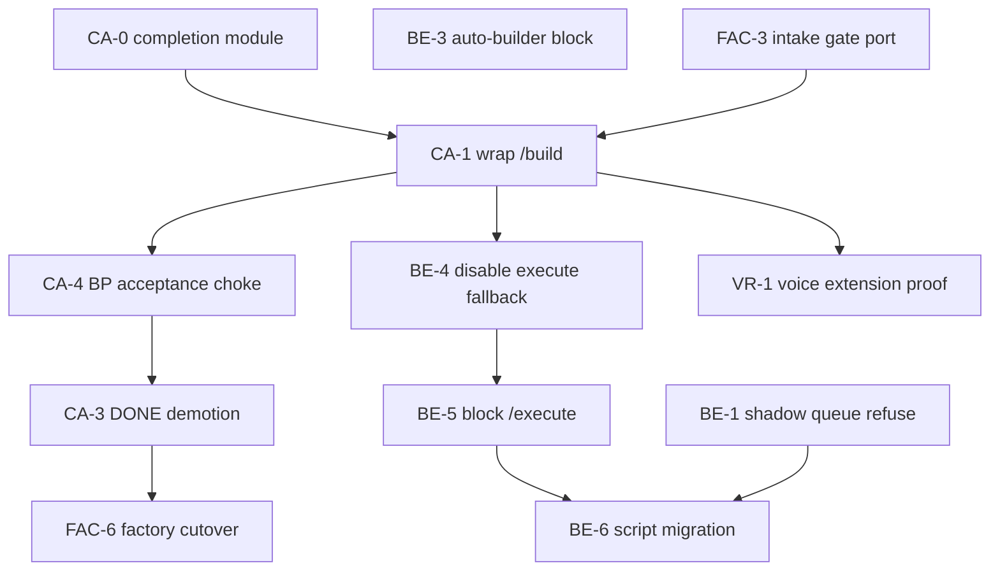

<!-- SYNOPSIS: BuilderOS Consolidation Roadmap V1 -->

# BuilderOS Consolidation Roadmap V1

**Status:** `AUTHORITATIVE PLAN` (doc-only — no runtime code in this slice)  
**Date:** 2026-06-13  
**Inputs:**

| Document | Role |
|----------|------|
| `docs/SYSTEM_CAPABILITY_INVENTORY.md` | 317 capabilities classified |
| `docs/SYSTEM_CAPABILITY_TRUTH_AUDIT.md` | 63 ACTIVE / 219 PARTIAL / 14 DISCONNECTED |
| `docs/PASS_DONE_AUTHORITY_AUDIT_V1.md` | 24 completion authorities; 8 FAIL_OPEN |
| `docs/COMPLETION_AUTHORITY_CONSOLIDATION_PLAN_V1.md` | Single completion choke design |
| `docs/BUILDER_EXECUTION_DUPLICATION_AUDIT.md` | Six execution paths; one canonical |
| `docs/BUILDER_EXECUTION_RETIREMENT_PLAN_V1.md` | Per-path retirement spec |

**Mission:** Master roadmap — **do not implement in this slice.**

---

## 1. Current state summary

BuilderOS is **capability-rich and governance-poor**. The repo is not missing tools; it is missing **single authority** for mount truth, git commit, and terminal success.

| Dimension | Today | Target |
|-----------|-------|--------|
| Capabilities inventoried | 317 | Same inventory, truth-aligned labels |
| ACTIVE (mounted + consumed + proof) | 63 | 120+ after mount repair + retirement |
| PARTIAL | 219 | Demote to evidence-only or wire |
| Completion authorities | 24 independent writers | 1 (`builderos-completion-authority.js`) |
| FAIL_OPEN terminal paths | 8 | 0 |
| Git commit actuators | 5+ (`/build`, `/execute`, auto-builder, shadow queue, CC fallback) | 1 (`/builder/build` via CC orchestration) |
| Composition roots (production) | 3 (`register-runtime-routes`, `server-routes`, `two-tier-system-init`) | 1 primary + documented adjuncts |
| Factory runtime | Separate `factory-staging/` process | Fenced until cutover receipt |
| Product queue SSOT | `builderos-reboot/BP_PRIORITY.json` (Machine) | Sole orchestration queue |
| Shadow queue | Quarantined (`BUILDER_QUEUE_ENABLED=1`) | Retired |

**Core problem:** Agents rebuild and false-PASS because **mount truth, execution truth, and completion truth are fragmented**. Six audits now map the fragmentation; this roadmap sequences consolidation without big-bang rewrites.

**Recent wins (baseline):**

- Outcome verifier on command-control governed loop (`5c3099a105`)
- PASS/DONE authority audit + completion plan + execution duplication audit + retirement plan
- Voice Rail VRV1-S01–S06 technical PASS; Action Inbox V1 technical PASS

---

## 2. Canonical systems

Systems that **survive consolidation** and become the only legal authority in their domain.

| Domain | Canonical artifact | Amendment / SSOT |
|--------|-------------------|-------------------|
| **Product work queue** | `builderos-reboot/BP_PRIORITY.json` | Machine domain; `lifeos:bp-priority:verify` HARD |
| **Git commit actuator** | `POST /api/v1/lifeos/builder/build` | Am 46; council builder routes |
| **Build orchestration intake** | `POST /api/v1/lifeos/builderos/command-control/jobs/:id/execute` | Am 46; must terminate through `/build` only |
| **Governed loop** | `services/builderos-governed-loop-executor.js` | OIL → PBB → build → verify → outcome |
| **Outcome verification** | `services/builder-outcome-verifier.js` | Subordinate to completion authority |
| **Completion authority (planned)** | `services/builderos-completion-authority.js` | Consolidation plan Phase 0–1 |
| **Precommit technical gate** | `services/builderos-precommit-governance.js` | Evidence-only after consolidation |
| **DONE / measurement evidence** | `builderos-build-done-gate-helper.js` | Evidence-only after Phase 3 |
| **Autonomous scheduler** | `scripts/governed-overnight-backlog-run.mjs` | Command-control only |
| **Runtime route spine** | `startup/register-runtime-routes.js` | Primary production mount |
| **Useful-work law** | `services/useful-work-guard.js` | All scheduled AI |
| **Hist boundary** | `builderos-reboot/HIST_DOMAIN_REGISTRY.json` | Read/salvage only |
| **Factory runtime (pre-cutover)** | `factory-staging/server.js` | Write/verify; no production git |
| **Voice Rail product surface** | `routes/lifeos-voice-rail-routes.js` | Am 21; CC-backed commands |
| **Memory evidence API** | `routes/memory-intelligence-routes.js` | Am 02 / 39 |
| **TSOS ledger** | `routes/token-accounting-routes.js`, `tokenos-routes.js` | Am 10 / 44 |
| **OIL proof** | `services/oil-security-receipts.js` | Am 40 |

---

## 3. Shadow systems

Exist on disk; **contradict BP law, SSOT, or single-path doctrine**. Retire or hard-quarantine.

| Shadow | Location | Contradiction |
|--------|----------|---------------|
| **Continuous builder queue** | `scripts/lifeos-builder-continuous-queue.mjs` | Parallel queue vs `BP_PRIORITY.json`; direct `/build` |
| **Builder daemon queue phase** | `scripts/lifeos-builder-daemon.mjs` | Invokes shadow queue each cycle |
| **Council `/execute`** | `routes/lifeos-council-builder-routes.js` | Commit bypass (no DONE/outcome/precommit full path) |
| **Execute fallback in governed loop** | `builderos-governed-loop-executor.js` `tryExecuteFallback()` | Canonical orchestration → non-canonical commit |
| **Auto-builder commit API** | `POST /api/v1/system/build`, `POST /api/build/run` | Parallel commit authority (two-tier) |
| **Legacy mission queue artifacts** | Hist `MISSION_QUEUE.json`, dashboard queue JSON | Hist domain; not product queue |
| **Direct `/build` success parsing** | Supervisor, retry-plan, build-chat scripts | Treats `committed: true` as delivery proof |
| **Orphan route files (~14)** | sleep, conflict-interrupt, marketing, tsos-task-ledger, etc. | Docs claim PRESENT; spine grep → not mounted |
| **`lumin-factory/` duplicate tree** | Parallel factory copy | Drift risk vs `factory-staging/` |
| **Old self-programming / self-improvement** | `services/self-programming.js`, `self-improvement-loop.js` | Superseded by governed loop + factory autopilot |

---

## 4. Half-migrated systems

Code exists and is partially wired; **not yet trustworthy as canonical**.

| System | Done | Missing |
|--------|------|---------|
| **Command-control** | Jobs API, governed loop, outcome check on CC path | `completion_receipt_id`; no `/execute` fallback retirement |
| **Council `/build`** | Precommit, DONE gate helper, syntax gates | Outcome verification; completion authority wrap |
| **Voice Rail** | STT/TTS/router mounted; VRV1 technical PASS | VRV1-S07 founder-direct provider proof; command→builder unblock |
| **Action Inbox** | Code + acceptance PASS | Founder usability pass; objective verdict alignment |
| **Memory / Historian** | 20+ services; intelligence + capsule ACTIVE | Historian contract on production spine; working memory disconnected |
| **TSOS** | Token accounting ACTIVE; tests | `tsos-task-ledger-routes.js` disconnected; duplicate TCO paths |
| **Factory-staging** | execute-step, BPB intake gate, historian | Production cutover receipt; completion authority adapter |
| **Product development gate** | Factory `bpb/intake-gate.js` slice | Not ported to production `/build` preflight |
| **BP acceptance scripts** | HTTP probes + receipt JSON | No `completion_receipt_id` choke |
| **Control plane DONE** | Token/OIL ledger measurement | Outcome parity; evidence-only demotion |
| **Mount registry truth** | `register-runtime-routes.js` primary | Sleep/conflict-interrupt regression; two-tier overlap undocumented |
| **Completion authority** | Outcome verifier module | `builderos-completion-authority.js` not created |

---

## 5. Duplication removal roadmap

**Goal:** One commit door, one queue, one mount truth doc.

| Phase | Work | Est. | Depends on |
|-------|------|------|------------|
| **D0** | Publish mount truth matrix (spine grep CI) | 1d | Truth audit |
| **D1** | Shadow queue hard refusal (exit 2) | 0.5d | — |
| **D2** | Daemon queue phase skip / redirect | 0.5d | D1 |
| **D3** | Auto-builder commit flags server-locked | 0.5d | — |
| **D4** | Disable `tryExecuteFallback` default | 1d | `/build` retry for `committed:false` |
| **D5** | Block external `/builder/execute` | 0.5d | D4 |
| **D6** | Migrate scripts → `scripts/lib/builder-canonical-run.mjs` | 2d | D4 |
| **D7** | Unmount or gate two-tier auto-builder in directed mode | 1d | D3 |
| **D8** | Orphan route decision: mount or Hist archive | 3d | D0 |
| **D9** | Collapse `lumin-factory/` duplicate after verify | 2d | Factory CI green |

**Exit criteria:** Grep shows single `commitToGitHub` call path from HTTP (council `/build` only); shadow queue npm scripts exit non-zero; CI mount matrix matches runtime.

---

## 6. Completion authority roadmap

From `COMPLETION_AUTHORITY_CONSOLIDATION_PLAN_V1.md`. **Order: 0 → 1 → 2 → 4 → 3 → 5 → 6.**

| Phase | Scope | Key files | Exit |
|-------|--------|-----------|------|
| **CA-0** | New module + unit tests only | `builderos-completion-authority.js`, tests | Module API frozen |
| **CA-1** | Wire `/builder/build` + dedupe governed loop | council builder routes, governed loop | Direct `/build` cannot return bare success |
| **CA-2** | Wire `/builder/execute` or block first | council builder routes | No commit success without grant |
| **CA-4** | BP acceptance + sync choke | `bp-acceptance-finish.mjs`, `bp-priority-sync.js` | PASS receipts require `completion_receipt_id` |
| **CA-3** | Demote DONE gate to evidence-only | done gate helper, control plane | `done_gate_passed` ≠ terminal PASS |
| **CA-5** | Runners / supervisor alignment | overnight backlog, supervisor, queue scripts | Parse `completion_granted` only |
| **CA-6** | Factory + mission recovery adapter | run-step, mission-lib, recovery scripts | Deferred until cutover |

**Rollback:** `BUILDEROS_COMPLETION_AUTHORITY=0` env break-glass.

---

## 7. Builder execution roadmap

Aligned with `BUILDER_EXECUTION_RETIREMENT_PLAN_V1.md`.

```
Founder / BP_PRIORITY / overnight runner
        │
        ▼
  command-control job create + execute
        │
        ▼
  governed-loop-executor (no /execute fallback)
        │
        ▼
  POST /builder/build  ──► grantBuildCompletion()
        │
        ▼
  job status: committed | FAIL_WRONG_OUTCOME
```

| Milestone | Action | Retirement plan ref |
|-----------|--------|---------------------|
| **BE-1** | Shadow queue refuse | Path 4 |
| **BE-2** | Daemon queue skip | Path 5 |
| **BE-3** | Auto-builder block | Path 3 |
| **BE-4** | Fallback disable | Path 2 |
| **BE-5** | `/execute` block | Path 1 |
| **BE-6** | Script migration | Path 7 |
| **BE-7** | Completion wrap on `/build` | Path 8 + CA-1 |
| **BE-8** | Factory fence CI | Path 6 |

---

## 8. Command-control roadmap

| Milestone | Work | Benefit |
|-----------|------|---------|
| **CC-1** | Job schema: `required_outcome`, `mission_id`, `blueprint_id` mandatory on create | Outcome verifier inputs always present |
| **CC-2** | Surface `completion_receipt_id` on job poll + founder debrief | Single proof object for C2 |
| **CC-3** | Retire execute fallback (BE-4) | Orchestration = commit path |
| **CC-4** | ZONE3 policy audit — document allowed targets vs block list | Reduce false blocks on Voice Rail builds |
| **CC-5** | Wire `command-center-communication-service` receipts to completion authority | C2 send → execute → provable outcome |
| **CC-6** | Neon persistence for completion receipts (optional CA-6) | Cross-session audit trail |
| **CC-7** | Acceptance: `run-command-control-completion-v1-acceptance.mjs` | HTTP proof for end-to-end grant |

**Canonical endpoints (keep):**

- `POST /api/v1/lifeos/builderos/command-control/jobs`
- `POST /api/v1/lifeos/builderos/command-control/jobs/:id/execute`
- `GET /api/v1/lifeos/builderos/command-control/jobs/:id`

---

## 9. Voice Rail roadmap

**BP rank 1:** `PRODUCT-VOICE-RAIL-V1-0001` — `EXTENSION_PENDING` (VRV1-S07).

| Milestone | Work | Status |
|-----------|------|--------|
| **VR-1** | VRV1-S07 founder direct provider live proof | Pending (`lifeos:founder-direct-provider:proof`) |
| **VR-2** | Command → command-control → build unblock for allowed intents | PARTIAL — capability proof shows blocks |
| **VR-3** | Surface `completion_receipt_id` in voice execution truth receipts | After CA-1 |
| **VR-4** | Founder usability pass (human bar) | Not started |
| **VR-5** | Native mic bridge (iOS/Android) | MISSING — defer post-consolidation |
| **VR-6** | Action Inbox + Voice Rail cross-link in BP priority order | Rank 3 inbox depends on VR command path |

**Do not:** Add parallel build path from Voice Rail; all system commands → CC → `/build`.

---

## 10. Memory roadmap

| Milestone | Work | Priority |
|-----------|------|----------|
| **MEM-1** | Enforce Hist boundary at runtime (reject Hist writes from Machine paths) | Medium |
| **MEM-2** | Mount or archive disconnected `working-memory` consumer | Low |
| **MEM-3** | Single memory HTTP surface doc: intelligence vs legacy `/memory/legacy` | Medium |
| **MEM-4** | Voice Rail founder memory → completion receipt linkage | After CA-1 |
| **MEM-5** | Historian summary: factory-only until production port receipt | Low |
| **MEM-6** | Memory lessons hook for GAP-022 self-repair (already partial) | Medium |

**Canonical:** `memory-intelligence-routes.js`, `memory-capsule-routes.js`, `conversation-history-routes.js`.

---

## 11. TSOS roadmap

| Milestone | Work | Priority |
|-----------|------|----------|
| **TSOS-1** | Mount decision on `tsos-task-ledger-routes.js` (superseded by build_task_ledger?) | Archive or wire |
| **TSOS-2** | Ensure all builder AI calls emit token receipts for DONE gate evidence | High (feeds CA-3) |
| **TSOS-3** | Consolidate TCO agent vs TCO routes consumer map | Medium |
| **TSOS-4** | `useful-work-guard` audit completion for TSOS schedulers | Medium |
| **TSOS-5** | TSOS platform kernel ↔ completion authority (operator consumption ledger) | Low |

**Canonical:** token accounting, TokenOS, api-cost-savings, operator consumption ledger.

---

## 12. Factory-staging roadmap

| Milestone | Work | Gate |
|-----------|------|------|
| **FAC-1** | CI: no `commitToGitHub` import under `factory-staging/` | Immediate |
| **FAC-2** | execute-step response includes `git_commit_authority: false` | Doc + API |
| **FAC-3** | Port BPB intake gate slice to production `/build` preflight | Unblocks G2 |
| **FAC-4** | Factory autopilot scheduler — confirm not production cutover | Env gate |
| **FAC-5** | Historian contract live in factory; production read-only | Hist law |
| **FAC-6** | Cutover receipt mission (explicit founder sign-off) | Before merge to spine |
| **FAC-7** | Completion authority adapter for factory `DONE` | After CA-0 + cutover |
| **FAC-8** | Collapse `lumin-factory/` duplicate tree | After FAC-1 green |

**Rule:** Factory is canonical **factory runtime**, not production git authority, until FAC-6 receipt.

---

## 13. Retirement sequence

Combined safest order (execution + completion + duplication):

| Step | Action | Rollback env |
|------|--------|--------------|
| 1 | CA-0: completion authority module (no wiring) | N/A |
| 2 | BE-1: shadow queue hard refuse | `BUILDER_QUEUE_ENABLED=1` local |
| 3 | BE-2: daemon queue skip | `BUILDER_DAEMON_QUEUE_PHASE=legacy` |
| 4 | BE-3: auto-builder commit block | `AUTO_BUILDER_COMMIT_ALLOWED=1` |
| 5 | CA-1: wrap `/builder/build` | `BUILDEROS_COMPLETION_AUTHORITY=0` |
| 6 | BE-4: disable execute fallback | `BUILDEROS_EXECUTE_FALLBACK=1` |
| 7 | BE-5: block `/execute` | `BUILDER_EXECUTE_ALLOW_LEGACY=1` |
| 8 | CA-4: BP acceptance choke | flag above |
| 9 | BE-6: script migration to CC | `BUILDER_USE_DIRECT_BUILD=1` local |
| 10 | CA-3: DONE gate demotion | flag above |
| 11 | D0/D8: mount truth + orphan routes | revert mount PR |
| 12 | FAC-1–3: factory fence + intake gate port | factory env isolation |
| 13 | VR-1: Voice Rail extension proof | product-only |
| 14 | FAC-6+: factory cutover (deferred) | explicit receipt |

---

## 14. Migration dependencies



| Blocker | Blocks | Unblock |
|---------|--------|---------|
| No completion module | CA-1, CA-4, VR-3 | CA-0 |
| Execute fallback still on | BE-5, trust in CC | BE-4 + `/build` retry |
| Shadow queue enabled in prod | BP drift, orphan commits | BE-1 + Railway env audit |
| `/build` without outcome wrap | False PASS on direct API | CA-1 |
| BP PASS without completion receipt | Wrong amendment marked complete | CA-4 |
| Factory cutover without receipt | Dual builder authority | FAC-6 founder sign-off |

---

## 15. Founder priority order

Derived from `builderos-reboot/BP_PRIORITY.json` **cross-cut with consolidation blockers**.

| Priority | Mission / work | Why now |
|----------|----------------|---------|
| **P0** | Consolidation CA-1 + BE-4/5 | Stops false delivery on all product builds |
| **P1** | Voice Rail VRV1-S07 extension proof | BP rank 1; founder-facing |
| **P2** | Action Inbox founder usability + objective verdict | BP rank 3; depends on trustworthy build path |
| **P3** | Conversation Commitments founder usability | BP rank 2; human bar only |
| **P4** | Product development gate (FAC-3 port) | NSSOT §2.11; blocks autonomous BPB |
| **P5** | Mount truth repair (sleep, conflict-interrupt) | Truth audit regression |
| **P6** | MarketingOS / site builder (email env) | Revenue path; Postmark env |
| **P7** | Factory cutover decision | Explicit defer until P0–P4 stable |
| **P8** | Native Voice Rail mic | Missing capability; post-P1 |
| **P9** | Hist salvage missions | Read-only; never blocks P0 |

**Operator rule:** No new autonomous queue artifacts. `BP_PRIORITY.json` is the queue.

---

## TOP 25 repairs by ROI

High benefit ÷ effort. **Effort:** S (<1d), M (1–3d), L (>3d). **Risk:** change blast radius.

| # | Repair | Effort | Risk | Benefit | Dependencies | Model |
|---|--------|--------|------|---------|--------------|-------|
| 1 | CA-1: Wrap `/builder/build` with completion authority | M | H | Closes #1 FAIL_OPEN | CA-0 | **Codex** |
| 2 | BE-4: Disable execute fallback default | S | M | Stops canonical-path bypass | `/build` retry | **Codex** |
| 3 | BE-1: Shadow queue hard refuse | S | L | Zero prod blast; stops parallel queue | — | **Codex** |
| 4 | BE-3: Auto-builder commit server-lock | S | L | Closes silent commit path | — | **Codex** |
| 5 | CA-0: Create completion authority module + tests | M | L | Unblocks all CA phases | — | **Claude Code** |
| 6 | VR-1: Founder direct provider live proof | S | L | Unblocks BP rank 1 extension | deploy | **Codex** |
| 7 | CA-4: BP acceptance requires completion receipt | M | M | Stops orphan PASS on products | CA-1 | **Codex** |
| 8 | BE-6: `builder-canonical-run.mjs` shared helper | M | L | One migration pattern for scripts | BE-4 | **Claude Code** |
| 9 | CC-2: Expose `completion_receipt_id` on job API | S | L | C2/Voice provability | CA-1 | **Codex** |
| 10 | FAC-3: Port BPB intake gate to production preflight | M | M | Machine "may begin now" gate | factory slice | **Claude Code** |
| 11 | D0: Mount truth CI matrix | M | L | Stops PRESENT over-claim | truth audit | **Gemini** |
| 12 | BE-5: Block `/builder/execute` external | S | M | Closes direct commit bypass | BE-4 | **Codex** |
| 13 | CA-3: DONE gate evidence-only demotion | M | M | Stops ledger theater PASS | CA-1 | **Codex** |
| 14 | TSOS-2: Token receipts on all builder AI calls | M | L | DONE gate + cost truth | — | **Codex** |
| 15 | CC-1: Mandatory `required_outcome` on CC job create | S | L | Better outcome verifier inputs | — | **Codex** |
| 16 | BE-2: Daemon queue phase skip | S | L | Prevents accidental shadow run | BE-1 | **Codex** |
| 17 | VR-2: Unblock command→CC for Voice Rail intents | M | M | Rank 1 product usability | CC stable | **Claude Code** |
| 18 | Fix sleep/conflict-interrupt mount regression | S | L | 3 routes ACTIVE again | D0 | **Codex** |
| 19 | `bp-priority-sync` completion receipt guard | S | M | Queue truth | CA-4 | **Codex** |
| 20 | Governed loop delegate to completion authority | S | L | Dedupe inline outcome calls | CA-1 | **Codex** |
| 21 | Postmark env bulk set via Railway API | S | L | Unblocks outreach/email products | env proof | **Codex** |
| 22 | FAC-1: Factory no-commitToGitHub CI grep | S | L | Prevents factory git bleed | — | **Codex** |
| 23 | Acceptance script: completion authority HTTP probe | S | L | Regression net | CA-1 | **Codex** |
| 24 | Mission recovery demote raw PASS | M | L | Stops governance≠outcome | CA-4 | **Claude Code** |
| 25 | Archive tsos-task-ledger orphan route | S | L | Removes duplicate authority | decision | **Gemini** |

---

## TOP 25 risk reductions

Ordered by **severity if left unfixed**.

| # | Risk reduction | Effort | Risk | Benefit | Dependencies | Model |
|---|----------------|--------|------|---------|--------------|-------|
| 1 | Wrap `/builder/build` — wrong outcome cannot return success | M | H | Eliminates highest FAIL_OPEN | CA-0 | **Codex** |
| 2 | Disable governed-loop `/execute` fallback | S | M | Closes hidden bypass in CC | — | **Codex** |
| 3 | Block external `/builder/execute` | S | M | Direct commit without gates | #2 | **Codex** |
| 4 | Retire shadow queue execution authority | S | L | Autonomous wrong-queue builds | — | **Codex** |
| 5 | Lock auto-builder commit flags server-side | S | L | Parallel git authority | — | **Codex** |
| 6 | BP sync reject PASS without completion receipt | M | M | Wrong blueprint marked complete | CA-1 | **Codex** |
| 7 | Acceptance scripts call completion authority | M | M | Product receipt theater | CA-4 | **Codex** |
| 8 | DONE gate cannot alone grant terminal PASS | M | M | Measurement≠delivery | CA-1 | **Codex** |
| 9 | `/build` retry path for `committed:false` (no fallback) | M | M | Safe BE-4 enablement | — | **Claude Code** |
| 10 | Railway prod env audit: no `BUILDER_QUEUE_ENABLED` | S | L | Ops misconfig prevention | — | **Codex** |
| 11 | CC jobs require `required_outcome` field | S | L | Outcome verifier always fed | — | **Codex** |
| 12 | Multi-Lane vs §2.18 regression in CI | S | L | Constitutional drift detection | CA-0 | **Codex** |
| 13 | Supervisor stops parsing `committed: true` alone | S | L | False KNOW lines | CA-1 | **Codex** |
| 14 | Factory CI blocks production git imports | S | L | Cutover accident prevention | — | **Codex** |
| 15 | Hist write guard on Machine paths | M | M | Legacy boundary violation | Hist law | **Claude Code** |
| 16 | Voice Rail system commands CC-only | S | L | Voice-triggered bypass | VR audit | **Codex** |
| 17 | Pre-commit: PASS receipts need completion field | S | M | Commit-time guard | CA-4 | **Codex** |
| 18 | Document `committed_but_not_complete` HTTP state | S | L | Operator clarity | CA-1 | **Claude Code** |
| 19 | Break-glass env registry + audit log | S | L | Controlled rollback | — | **Claude Code** |
| 20 | Mission recovery: governance PASS ≠ outcome PASS | M | L | False mission closure | CA-4 | **Claude Code** |
| 21 | Remove duplicate `lumin-factory/` tree | M | M | Drift / wrong edit target | FAC-1 | **Gemini** |
| 22 | Two-tier auto-builder unmount in directed mode | M | M | Third composition root shrink | BE-3 | **Claude Code** |
| 23 | useful-work-guard on remaining AI bypasses | M | M | Token burn + ungoverned calls | audit script | **Gemini** |
| 24 | ZONE3 block list review for product targets | M | L | False build blocks | CC policy | **Claude Code** |
| 25 | Neon completion receipt persistence | M | L | Forensic audit trail | CA-6 | **Codex** |

---

## TOP 25 complexity reductions

Reduce moving parts, duplicate paths, and agent confusion.

| # | Complexity reduction | Effort | Risk | Benefit | Dependencies | Model |
|---|---------------------|--------|------|---------|--------------|-------|
| 1 | Single git commit HTTP path (`/build` only) | M | H | 5 actuators → 1 | BE-4,5 | **Claude Code** |
| 2 | Single product queue (`BP_PRIORITY.json`) | S | L | Removes queue SSOT debate | BE-1 | **Claude Code** |
| 3 | Single completion writer module | M | M | 24 authorities → 1 | CA-0 | **Claude Code** |
| 4 | Single autonomous runner (overnight → CC) | M | L | Retire daemon+queue pair | BE-2,6 | **Claude Code** |
| 5 | Mount truth matrix doc + CI | M | L | 317-row inventory trustworthy | D0 | **Gemini** |
| 6 | `builder-canonical-run.mjs` one script API | M | L | 6 scripts → 1 pattern | BE-6 | **Claude Code** |
| 7 | Archive 14 disconnected routes to Hist | M | L | Smaller mental route map | D8 | **Gemini** |
| 8 | Collapse three composition roots doc | S | L | Clear spine for agents | — | **Claude Code** |
| 9 | Retire tsos-task-ledger duplicate | S | L | One task ledger concept | — | **Gemini** |
| 10 | Unmount marketing-routes or wire Am 41 | M | M | Orphan removal | founder | **Claude Code** |
| 11 | Memory: document intelligence vs legacy only | S | L | One memory entry point | — | **Claude Code** |
| 12 | Factory vs production boundary one-pager | S | L | Stops wrong-layer edits | FAC-1 | **Claude Code** |
| 13 | Deprecate npm shadow queue scripts | S | L | package.json clarity | BE-1 | **Codex** |
| 14 | Command-control only orchestration diagram in AGENTS.md | S | L | Agent read order | — | **Claude Code** |
| 15 | Single PASS vocabulary (`completion_granted`) | M | M | DONE/PASS/COMPLETE/SUCCESS chaos | CA-1 | **Claude Code** |
| 16 | Merge governed loop outcome into authority | S | L | One outcome call site | CA-1 | **Codex** |
| 17 | Remove `tryExecuteFallback` function entirely | S | M | Less branch logic | BE-4 | **Codex** |
| 18 | Auto-builder read-only mode only | S | L | Two-tier shrink | BE-3 | **Codex** |
| 19 | Single acceptance finish helper | M | M | Many `run-*-acceptance` patterns | CA-4 | **Codex** |
| 20 | BP receipt schema v2 (completion fields) | M | L | One receipt shape | CA-4 | **Claude Code** |
| 21 | Delete `lumin-factory/` duplicate | M | M | One factory tree | verify | **Gemini** |
| 22 | Consolidate command-center route files | L | M | Fewer C2 entry points | audit | **Claude Code** |
| 23 | Self-programming → Hist archive | S | L | Old path confusion gone | Hist | **Gemini** |
| 24 | ENV_REGISTRY master switch section | S | L | One rollback doc | retirement plan | **Claude Code** |
| 25 | Link all 6 audit docs from BUILDEROS AGENTS.md | S | L | Single agent entry | — | **Claude Code** |

---

## Model selection guide

| Model | Best for |
|-------|----------|
| **Codex** | Small precise diffs, route wiring, tests, env scripts, npm, CI grep gates |
| **Claude Code** | Multi-file architecture, consolidation plans, AGENTS/SSOT amendments, cross-domain roadmaps |
| **Gemini** | Large-repo audits, inventory/truth matrices, orphan classification, duplicate tree analysis |

---

## Success metrics (consolidation complete)

| Metric | Now | Target |
|--------|-----|--------|
| FAIL_OPEN completion paths | 8 | 0 |
| Git commit HTTP actuators | 5+ | 1 |
| ACTIVE capabilities (truth audit) | 63 | ≥120 |
| Product PASS without completion receipt | Allowed | Blocked |
| Shadow queue runnable in prod | Opt-in | Refused |
| Factory git authority on production spine | Fenced | Explicit receipt only |
| BP rank 1 Voice Rail | EXTENSION_PENDING | founder_usability_pass |

---

## Change receipt

| Date | File | What |
|------|------|------|
| 2026-06-13 | `docs/BUILDEROS_CONSOLIDATION_ROADMAP_V1.md` | Master consolidation roadmap V1 from six completed audits |
