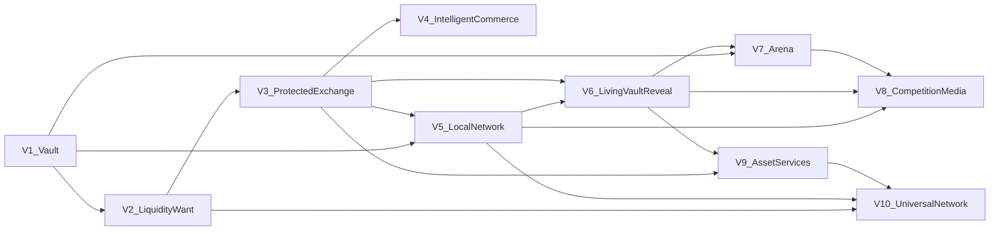
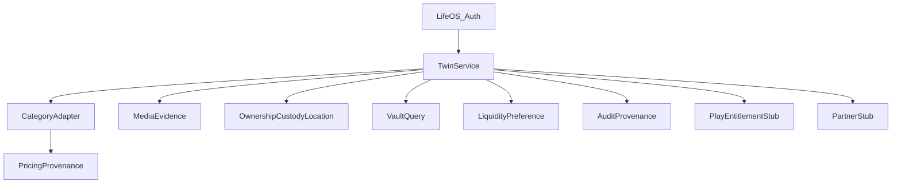

<!-- SYNOPSIS: Collectibles version and module dependency graph -->

# Collectibles — Dependency Graph

## 1. Version dependencies

**Rules:**
- Later versions may depend on earlier canonical entities.
- Earlier versions must not require later versions to provide value.
- No dependency cycles between versions.

## 2. Logical module dependencies (V1 core)

## 3. Cycle detection result

| Check | Result |
|---|---|
| Version graph cycles | None |
| V1 module cycles | None (DAG) |
| Offer ↔ Twin | Offers depend on Twin; Twin does not depend on Offer runtime |
| PlayEntitlement ↔ IpPermission | Independent; Arena joins both at session time only |

## 4. External dependencies

| Dep | Blocking for |
|---|---|
| LifeOS auth | V1 |
| Postgres | V1 |
| Vision provider keys | V1 identify (fallback Needs Review if all down) |
| Scryfall (MTG) | MTG price quality; Vault still works with needs_review |
| Payment provider contract | V3 |
| IP grants | V7 protected adapters |
| Licensed lending partners | V9 lending routes |
