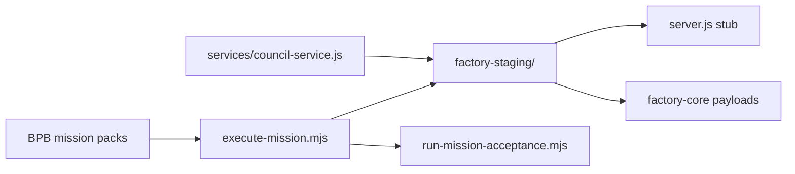

# Factory Implementation Guide

This guide is the **fast path** from mission packs to a runnable staging tree. A cold agent should be able to follow it without re-reading the whole thread.

## Architecture (one screen)



| Layer | Location | Role |
|-------|----------|------|
| Mission packs | `builderos-reboot/MISSIONS/FACTORY-REBOOT-000*` | Frozen blueprints + acceptance |
| Executor | `builderos-reboot/scripts/` | Mechanical step runner |
| Staging runtime | `factory-staging/` | Materialized payloads + minimal server |
| Parts car | `services/`, docs | Import sources only when blueprint says so |

## Commands (copy/paste)

From repo root:

```bash
# Verify all mission packs (128 tests across 0001–0004)
npm run factory:acceptance

# Regenerate 0004 blueprint from manifests (after CONTENT edits)
npm run factory:generate-0004
npm run factory:acceptance:sync

# Materialize factory-staging from proof mission
npm run factory:materialize

# Run one step only
npm run factory:step -- FACTORY-REBOOT-0004 S436

# Staging smoke check
cd factory-staging && npm install && npm run check && npm start
# curl http://127.0.0.1:3099/health
```

## Mission map

| Mission | Scope | Mode |
|---------|-------|------|
| 0001 | Reboot workspace + bootstrap pack | verify/copy |
| 0002 | Segments 2–4 schema payloads | verify/copy |
| 0003 | Phases 5–10 runtime payloads (in ARTIFACTS/) | verify/copy |
| 0004 | **Proof**: materialize `factory-staging/` + SM-004 council import | first materialization |

## How to implement the next slice

### 1. Add a new file to factory-staging

**Do not hand-edit `factory-staging/` for governed work.** Add a step to a mission blueprint:

1. Put exact bytes in `MISSIONS/FACTORY-REBOOT-000X/CONTENT/` (BPB-owned template), **or** pin an existing repo file as `content_source_path`.
2. Add step to `BLUEPRINT.json` with `byte_exact_copy` + sha256.
3. Run `sync-acceptance-from-blueprint.mjs` for that mission.
4. Run `execute-mission-step.mjs` or full `execute-mission.mjs`.

### 2. Wire live execute-step dispatch (0005+)

Current state: `POST /factory/execute-step` returns `501 NOT_IMPLEMENTED` but validates blocked-return shape.

Next mission should:

- Implement dispatch in `factory-staging/startup/register-routes.js` using `factory-core/builder/*` and `factory-core/sentry/verify-step-result.js`
- Add integration test calling one real step
- Keep council adapter behind explicit import boundary

### 3. Cut over to clean `Lumin-Factory` repo

When proof receipts exist:

1. Copy `factory-staging/` as repo root (minus `node_modules`)
2. Copy `builderos-reboot/MISSIONS/` as `missions/` or submodule
3. Run acceptance + determinism runbook on fresh clone

## File conventions

- **Blueprint step** → one file, one action, sha256 pin, sandbox boundary
- **Acceptance** → generated from blueprint; run after every materialize
- **CONTENT/** → BPB exact bytes for first-time targets (not self-referential acceptance hash)
- **ARTIFACTS/** (0003) → canonical payload library copied into staging by 0004

## Stop conditions (auto-pilot)

HALT and update `HANDOFF.md` if:

- acceptance fails and hash pin is wrong (refresh blueprint, don't guess)
- step needs greenfield without `content_source_path` (executor blocks by design)
- strategic ambiguity appears (return `BLOCKED_RETURN_TO_BPB`)

## Evidence checklist before claiming "implemented"

- [ ] `npm run factory:acceptance` → all pass
- [ ] `npm run factory:materialize` → exit 0
- [ ] `cd factory-staging && npm run check` → all pass
- [ ] `GET /health` → `{ ok: true }` with server running
- [ ] Council import sha256 matches parts car (`COUNCIL_IMPORT_RECEIPT.json`)

## Script reference

| Script | Purpose |
|--------|---------|
| `mission-lib.mjs` | Shared sha256, dependency sort, write_file_exact |
| `execute-mission-step.mjs` | One step |
| `execute-mission.mjs` | Full mission + acceptance |
| `sync-acceptance-from-blueprint.mjs` | Regenerate ACCEPTANCE_TESTS.json |
| `refresh-blueprint-hashes.mjs` | Re-pin sha256 from disk |
| `generate-factory-reboot-0004.mjs` | Rebuild proof mission from manifests |
| `run-all-mission-acceptance.mjs` | CI-friendly gate |
